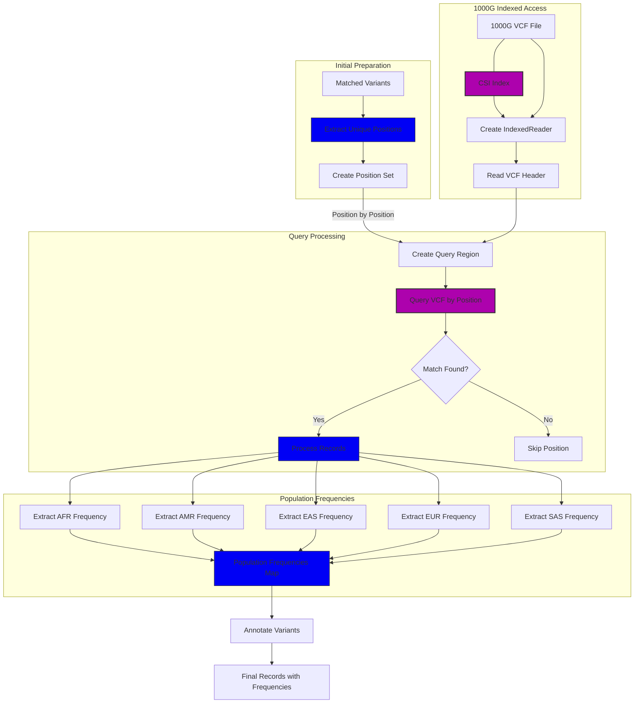

# 1000 Genomes Frequency Extraction in Pathogenic Variant Finder

This document provides a detailed explanation of how population allele frequencies are extracted from the 1000 Genomes Project data in the Pathogenic Variant Finder tool, a component that has historically been prone to issues during updates and functional improvements.

## Overview

The 1000 Genomes Project provides genomic data for over 2,500 individuals from various populations worldwide. The allele frequencies from this dataset are critical for determining how common a particular variant is in different populations, which can help assess its potential clinical significance.

In the Pathogenic Variant Finder tool, the 1000 Genomes data is used to supplement ClinVar pathogenic variants with population-specific allele frequencies, enabling more comprehensive variant interpretation.



## Data Source and Structure

The tool uses the 1000 Genomes Phase 3 VCF file, which is downloaded from the Ensembl FTP server:

```
# For GRCh37 (hg19)
https://ftp.ensembl.org/pub/grch37/variation/vcf/homo_sapiens/1000GENOMES-phase_3.vcf.gz

# For GRCh38 (hg38)
https://ftp.ensembl.org/pub/current_variation/vcf/homo_sapiens/1000GENOMES-phase_3.vcf.gz
```

The corresponding CSI (Coordinate-Sorted Index) files are also downloaded to enable efficient random access to the VCF.

The 1000 Genomes VCF contains frequency information in the INFO field for several populations:
- **AFR**: African populations
- **AMR**: American populations
- **EAS**: East Asian populations
- **EUR**: European populations
- **SAS**: South Asian populations

## Indexed Access Strategy

Rather than parsing the entire 1000 Genomes VCF file (which would be computationally expensive), the tool uses an indexed access approach to efficiently query only the specific positions of interest.

### Workflow for Frequency Extraction

1. **Identify Variants of Interest**
   The tool first processes ClinVar data to identify pathogenic variants from the user's input file. These positions form the "keys of interest" for querying the 1000 Genomes data.

2. **Create a Set of Unique Genomic Regions**
   To optimize performance, duplicate positions are removed by creating a set of unique chromosomes and positions:

   ```rust
   let mut unique_regions: HashSet<(String, u32)> = HashSet::new();
   for (chr, pos, _ref, _alt) in keys_of_interest.iter() {
       unique_regions.insert((chr.clone(), *pos));
   }
   ```

3. **Load the CSI Index**
   The CSI index is loaded to enable random access to the VCF file:

   ```rust
   let index_file = File::open(&onekg_index_path)?;
   let mut csi_reader = csi::io::Reader::new(index_file);
   let index = csi_reader.read_index()?;
   ```

4. **Create an Indexed Reader**
   The indexed reader combines the VCF file with its index:

   ```rust
   let file = File::open(&onekg_file_path)?;
   let mut reader = IndexedReader::new(file, index);
   let header = reader.read_header()?;
   ```

5. **Query Each Region**
   For each unique region, the tool creates a query using the Noodles library:

   ```rust
   let region_str = format!("{}:{}-{}", chr, pos, pos);
   let region_obj: Region = region_str.parse()?;
   if let Ok(mut query) = reader.query(&header, &region_obj) {
       // Process query results
   }
   ```

6. **Extract Allele Frequencies**
   For each record returned by a query, the tool checks if the variant matches one of the keys of interest. If so, it extracts the population-specific allele frequencies from the INFO field.

## Frequency Extraction Implementation

The core of the frequency extraction logic is in the processing of each VCF record's INFO field. For a given record, the tool first checks if it contains one of the variants of interest:

```rust
for (alt_idx, alt) in record_alts.iter().enumerate() {
    let key = (record_chr.clone(), record_pos.get() as u32, record_ref.clone(), alt.clone());
    if keys_of_interest.contains(&key) {
        // Extract frequencies for this variant
    }
}
```

### The `get_freq` Helper Function

A key component is the `get_freq` helper function, which extracts population frequencies for a specific alternate allele from the INFO field:

```rust
let get_freq = |key: &str, alt_idx: usize| -> Option<f64> {
    match info.get(&header, key) {
        Some(Ok(Some(Value::Array(array)))) => {
            match array {
                noodles::vcf::variant::record::info::field::value::Array::Float(values) => {
                    let mut iter = values.iter();
                    if let Some(Ok(Some(f))) = iter.nth(alt_idx) {
                        Some(f64::from(*f))
                    } else {
                        None
                    }
                },
                _ => None, // Handle other Array variants
            }
        },
        _ => None,
    }
};
```

This function:
1. Attempts to retrieve a specific INFO field (like "AFR", "EUR", etc.)
2. Checks if the field exists and contains an array of values
3. Verifies the array contains floating-point values
4. Extracts the value at the index corresponding to the alternate allele being processed
5. Converts the value to an f64 and returns it wrapped in an Option

### Extracting Population-Specific Frequencies

The tool extracts frequencies for each population group:

```rust
let afr = get_freq("AFR", alt_idx);
let amr = get_freq("AMR", alt_idx);
let eas = get_freq("EAS", alt_idx);
let eur = get_freq("EUR", alt_idx);
let sas = get_freq("SAS", alt_idx);
```

These frequencies are then stored in a HashMap, using the variant's key (chromosome, position, reference allele, alternate allele) as the map key:

```rust
onekg_freqs.insert(key, (afr, amr, eas, eur, sas));
```

## Integrating Frequencies into Final Results

After extracting all the frequencies, the tool integrates them with the ClinVar data to create the final records:

```rust
for r in &temp_results {
    let key = (r.chr.clone(), r.pos, r.ref_allele.clone(), r.alt_allele.clone());
    let (af_afr, af_amr, af_eas, af_eur, af_sas) = match onekg_freqs.get(&key) {
        None => (None, None, None, None, None),
        Some((afr, amr, eas, eur, sas)) => (*afr, *amr, *eas, *eur, *sas),
    };
    
    // Create final record with these frequencies
    let final_rec = FinalRecord {
        // Other fields...
        af_afr,
        af_amr,
        af_eas,
        af_eur,
        af_sas,
    };
    final_records.push(final_rec);
}
```

## Common Issues and Fragility Points

The 1000 Genomes frequency extraction has several points of potential fragility:

### 1. VCF Format and INFO Field Changes

The INFO fields in the 1000 Genomes VCF may change in structure or naming between different releases. For example:
- Population codes might be changed or expanded
- Array structure might be altered
- Field types might shift between Float, Integer, or String

### 2. Noodles API Changes

The Noodles library undergoes regular updates, and its API may change. The code that extracts values from INFO fields is particularly sensitive to these changes:

```rust
match info.get(&header, key) {
    Some(Ok(Some(Value::Array(array)))) => {
        match array {
            noodles::vcf::variant::record::info::field::value::Array::Float(values) => {
                // Array access pattern is dependent on Noodles internal implementation
            },
            _ => None,
        }
    },
    _ => None,
}
```

Particular areas of concern include:
- Changes to the `Result` and `Option` nesting pattern in the return value of `info.get()`
- Changes in how arrays are represented or accessed
- Changes in type conversion semantics

### 3. Indexed Access Reliability

The indexed access approach depends on correctly functioning CSI indexes. Issues can arise if:
- The downloaded index is corrupted or incompatible with the VCF
- The index uses a different coordinate system than expected
- The region query syntax changes in the Noodles library

### 4. Chromosome Naming Consistency

Different resources may use different chromosome naming conventions (e.g., "1" vs. "chr1"). The 1000 Genomes data might use a different convention than the ClinVar or user input data.

## Best Practices for Maintaining the Frequency Extraction Code

1. **Version-Lock Dependencies**:
   Explicitly specify the Noodles dependency version to prevent breaking changes:
   
   ```toml
   noodles = { version = "0.95.0", features = ["vcf", "csi", "core"] }
   ```

2. **Add Comprehensive Error Handling**:
   Every step of the frequency extraction process should have robust error handling with informative error messages.

3. **Add Defensive Null Checking**:
   The code should defensively check for None/null values at every step. The existing pattern of using Option types and match statements helps with this.

4. **Add Logging for Debugging**:
   Add detailed logging to track the frequency extraction process:
   
   ```rust
   println!("Querying region {}:{}", chr, pos);
   writeln!(log_file, "Found {} matching variants at position {}:{}", count, chr, pos)?;
   ```

5. **Add Unit Tests**:
   Create unit tests with mock 1000 Genomes data to verify that the frequency extraction works correctly.

6. **Add Data Validation**:
   Validate the extracted frequencies to ensure they are within expected ranges (0.0 to 1.0).

## Conclusion

The 1000 Genomes frequency extraction is a critical component of the Pathogenic Variant Finder that enhances the tool's ability to interpret variants by providing population-specific allele frequencies. By understanding the implementation details, potential fragility points, and following best practices, the code can be maintained and updated with minimal risk of introducing bugs. 