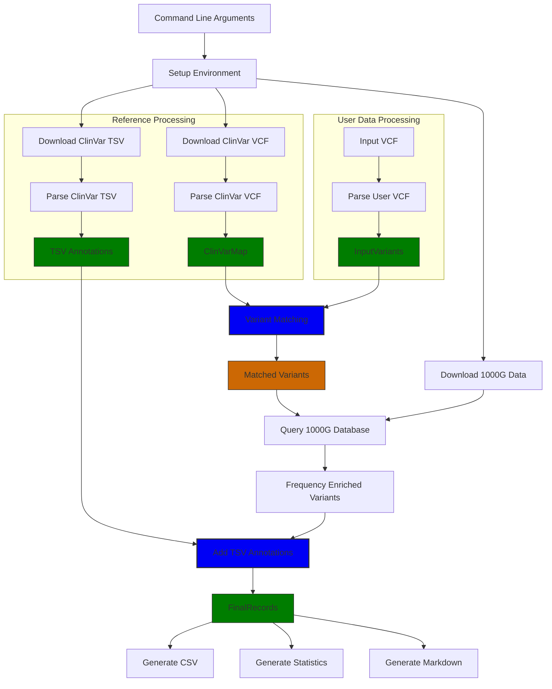

# Pathogenic Variant Finder: Implementation Details

This document provides an in-depth explanation of how the Pathogenic Variant Finder tool works, including its architecture, data flow, and key implementation details.

## Table of Contents

1. [Overview](#overview)
2. [Program Flow](#program-flow)
3. [Key Data Structures](#key-data-structures)
4. [Key Functions and Components](#key-functions-and-components)
5. [Performance Optimizations](#performance-optimizations)
6. [File Format Handling](#file-format-handling)
7. [Future Enhancement Opportunities](#future-enhancement-opportunities)

## Overview

The Pathogenic Variant Finder is a Rust-based tool that identifies potentially pathogenic genetic variants by cross-referencing user-supplied VCF files with the ClinVar database and incorporating population frequency data from the 1000 Genomes Project. It supports both GRCh37 (hg19) and GRCh38 (hg38) genome builds.

The tool leverages Rust's performance capabilities along with several key libraries:
- **Rayon** for parallel processing
- **Noodles** for efficient bioinformatics file format handling
- **Flate2** for gzip compression/decompression
- **Reqwest** for downloading reference data

## Program Flow

The program follows this high-level flow:

1. **Parse Command-Line Arguments**: Process user inputs (genome build, input file).
2. **Setup Environment**: Ensure reference data is available or download it.
3. **Process Reference Data**:
   - Parse ClinVar VCF to identify pathogenic variants.
   - Parse ClinVar TSV for detailed variant annotations.
4. **Process User Input**:
   - Parse user's VCF to extract variants.
5. **Match and Annotate Variants**:
   - Identify user variants that match pathogenic variants in ClinVar.
   - Enrich matched variants with 1000 Genomes allele frequency data.
   - Add detailed annotations from ClinVar TSV.
6. **Output Results**: 
   - Generate CSV with annotated variants.
   - Create summary statistics text file.
   - Produce interactive markdown report (unless disabled).



## Key Data Structures

### ClinVarRecord

```rust
struct ClinVarRecord {
    chr: String,
    pos: u32,
    ref_allele: String,
    alt_allele: String,
    clnsig: String,
    is_alt_pathogenic: bool,
    gene: Option<String>,
    allele_id: Option<i32>,
    clnrevstat: Option<String>,
    clndn: Option<String>,
    af_esp: Option<f64>,
    af_exac: Option<f64>,
    af_tgp: Option<f64>,
}
```

This structure holds essential information extracted from the ClinVar VCF file. Each instance represents a single variant with clinical significance information. The `is_alt_pathogenic` flag indicates whether the alternate allele is classified as pathogenic.

### InputVariant

```rust
struct InputVariant {
    chr: String,
    pos: u32,
    ref_allele: String,
    alts: Vec<(String, bool)>, // (alt_allele, is_present_in_genotype)
    genotype: String,
}
```

This structure represents a variant from the user's input VCF file. The `alts` field contains a vector of tuples, each holding an alternate allele and a boolean indicating whether that allele is present in the sample's genotype.

### ClinVarTsvRecord

```rust
struct ClinVarTsvRecord {
    molecular_consequence: Option<String>,
    functional_consequence: Option<String>,
    mode_of_inheritance: Option<String>,
    preferred_values: Option<String>,
    citations: Option<String>,
    comments: Option<String>,
    family_data: Option<String>,
    record_status: Option<String>,
    description: Option<String>,
    date_last_evaluated: Option<String>,
}
```

This structure contains detailed annotations extracted from the ClinVar TSV summary file, providing deeper context about variants.

### FinalRecord

```rust
struct FinalRecord {
    // Basic variant information
    chr: String,
    pos: u32,
    ref_allele: String,
    alt_allele: String,
    
    // ClinVar information
    clnsig: String,
    is_alt_pathogenic: bool,
    gene: Option<String>,
    allele_id: Option<i32>,
    genotype: String,
    review_stars: u8,
    clndn: Option<String>,
    
    // Allele frequencies
    af_esp: Option<f64>,
    af_exac: Option<f64>,
    af_tgp: Option<f64>,
    af_afr: Option<f64>,
    af_amr: Option<f64>,
    af_eas: Option<f64>,
    af_eur: Option<f64>,
    af_sas: Option<f64>,
    
    // Detailed ClinVar TSV annotations
    molecular_consequence: Option<String>,
    functional_consequence: Option<String>,
    mode_of_inheritance: Option<String>,
    preferred_values: Option<String>,
    citations: Option<String>,
    comments: Option<String>,
    family_data: Option<String>,
    record_status: Option<String>,
    description: Option<String>,
    date_last_evaluated: Option<String>,
}
```

This comprehensive structure combines all information about a variant, including basic coordinates, clinical significance, genotype information, allele frequencies from different populations, and detailed annotations.

## Key Functions and Components

### Command-Line Argument Parsing

The tool uses Clap to parse command-line arguments:

```rust
#[derive(Parser)]
struct Args {
    /// Genome build: must be "GRCh37" (hg19) or "GRCh38" (hg38)
    #[arg(short, long)]
    build: String,

    /// Path to the input VCF (can be uncompressed or gzipped)
    #[arg(short, long, value_name = "FILE")]
    input: PathBuf,
    
    /// Include variants of uncertain significance (VUS)
    #[arg(long)]
    include_vus: bool,
    
    /// Include benign variants
    #[arg(long)]
    include_benign: bool,
    
    /// Generate markdown report (enabled by default)
    #[arg(long, default_value = "true")]
    markdown_report: bool,
}
```

This defines the following arguments:
- `build`: The genome build (GRCh37 or GRCh38)
- `input`: Path to the user's VCF file
- `include_vus`: Flag to include variants of uncertain significance
- `include_benign`: Flag to include benign variants
- `markdown_report`: Flag to toggle generation of markdown report (enabled by default)

### Reference Data Management

#### `download_file`

This function handles downloading reference files with a progress bar. It attempts to use parallel chunk downloads when supported by the server, falling back to a single-threaded download otherwise:

```rust
fn download_file(
    url: &str,
    out_path: &Path,
    log_file: &mut File,
) -> Result<(), DownloadError>
```

Key features:
- Checks if the server supports HTTP range requests for parallel downloads
- Uses atomic counters for tracking download progress
- Implements a fallback mechanism for servers not supporting range requests
- Provides real-time progress visualization

### VCF Parsing

#### `parse_clinvar_vcf_gz`

This function parses the ClinVar VCF to extract pathogenic variants:

```rust
fn parse_clinvar_vcf_gz(
    path_gz: &Path,
    log_file: &mut File,
) -> Result<(ClinVarMap, String), Box<dyn Error>>
```

It utilizes Rayon for parallel processing of VCF lines, significantly improving performance on multi-core systems. The function returns a map of variants keyed by their genomic coordinates and a string containing the file date.

#### `parse_input_line`

This helper function parses a single line from the user's VCF file:

```rust
fn parse_input_line(line: &str) -> Option<(String, InputVariant)>
```

It normalizes chromosome names (removing "chr" prefix and handling mitochondrial chromosomes), extracts genotype information, and determines which alternate alleles are present in the sample.

#### `parse_input_vcf`

This function processes the user's input VCF file, handling both compressed and uncompressed formats:

```rust
fn parse_input_vcf(path: &Path, log_file: &mut File) -> Result<Vec<(String, InputVariant)>, Box<dyn Error>>
```

It dispatches the parsing to Rayon's parallel iterator for efficient multi-threaded processing.

### Noodles Integration

The tool uses Noodles for efficient handling of genomic file formats, particularly for indexing and querying the 1000 Genomes VCF:

```rust
let mut csi_reader = csi::io::Reader::new(index_file);
let index = csi_reader.read_index()?;
let mut reader = vcf::io::indexed_reader::IndexedReader::new(file, index);
```

This allows efficient random access to the 1000 Genomes VCF file by genomic position, avoiding the need to read the entire file.

### Variant Matching and Annotation

The tool matches user variants against ClinVar pathogenic variants using a HashMap for efficient lookups:

```rust
let temp_results: Vec<TempRecord> = input_variants
    .par_iter()
    .flat_map_iter(|(_, iv)| {
        let mut local_found = Vec::new();
        for (alt_a, is_present) in &iv.alts {
            if !is_present {
                continue;
            }
            let key = (iv.chr.clone(), iv.pos, iv.ref_allele.clone(), alt_a.clone());
            if let Some(cv) = clinvar_map.get(&key) {
                if !cv.is_alt_pathogenic {
                    continue;
                }
                // Add variant to results
                // ...
            }
        }
        local_found
    })
    .collect();
```

This approach:
1. Processes variants in parallel using Rayon
2. Checks if each alternate allele is present in the genotype
3. Looks up each variant in the ClinVar map
4. Filters for pathogenic variants

### 1000 Genomes Frequency Integration

The tool extracts population-specific allele frequencies from the 1000 Genomes VCF using Noodles' indexed querying capabilities:

```rust
for (chr, pos) in unique_regions {
    let region_str = format!("{}:{}-{}", chr, pos, pos);
    let region_obj: Region = region_str.parse()?;
    if let Ok(mut query) = reader.query(&header, &region_obj) {
        // Process query results
    }
}
```

This approach:
1. Creates a set of unique regions (chromosome + position) to query
2. Parses each region into a Noodles Region object
3. Queries the indexed VCF at each region
4. Extracts population-specific frequencies from the INFO field

## Performance Optimizations

### Parallel Processing

The tool extensively uses Rayon for parallel processing:

```rust
let chunk_maps: Vec<ClinVarMap> = lines
    .par_iter()
    .map(|line| {
        // Process line
    })
    .collect();
```

This enables efficient utilization of all available CPU cores, significantly improving performance for parsing large files.

### Efficient Data Structures

The tool uses HashMaps and HashSets for fast lookups:

```rust
type ClinVarMap = HashMap<(String, u32, String, String), ClinVarRecord>;
```

This key structure enables O(1) lookups when matching variants by their genomic coordinates.

### Indexed Access

For the 1000 Genomes data, the tool uses indexed access via Noodles to avoid scanning the entire file:

```rust
let mut reader = vcf::io::indexed_reader::IndexedReader::new(file, index);
// ...
let query = reader.query(&header, &region_obj)?;
```

This allows for efficient retrieval of variants at specific genomic positions.

### Chunked Downloads

The `download_file` function implements parallel chunk downloads for faster retrieval of reference data:

```rust
let num_chunks = num_cpus::get();
let chunk_size = total_size / num_chunks as u64;
// ...
for (i, (start, end)) in ranges.into_iter().enumerate() {
    // Download chunk in parallel
}
```

This approach utilizes available bandwidth more efficiently.

## File Format Handling

### VCF Processing

The tool uses a combination of custom parsing and Noodles for VCF handling:

1. Custom parsing for the ClinVar VCF and user input VCF to extract relevant fields quickly
2. Noodles for indexed access to the 1000 Genomes VCF

### Gzip Handling

The tool handles compressed files using Flate2:

```rust
let decoder = MultiGzDecoder::new(file);
let reader = BufReader::new(decoder);
```

This allows processing of gzipped VCF files without manual decompression.

### CSV Output Generation

The tool uses the CSV crate for structured output:

```rust
let mut wtr = csv::Writer::from_writer(std::io::stdout());
wtr.write_record(&[
    "Chromosome",
    "Position",
    // More fields...
])?;
```

This ensures standards-compliant CSV generation with proper escaping of special characters.

## Future Enhancement Opportunities

1. **User-specified filters**: Allow filtering variants by clinical significance, allele frequency, etc.
2. **Integration with additional databases**: Add support for other variant databases like OMIM, ClinGen, etc.
3. **Cache management**: Implement version checking and automatic updates for reference data.
4. **Advanced variant annotation**: Add support for annotating variants with functional predictions, conservation scores, etc.
5. **API integration**: Provide a library interface for integration into other tools.
6. **Configurable output formats**: Support additional output formats like JSON, VCF, etc.
7. **Genome build conversion**: Add tools to convert variants between different genome builds.
8. **Unit and integration tests**: Improve test coverage for more robust development.

By understanding the implementation details outlined in this document, developers can more effectively maintain and extend the Pathogenic Variant Finder tool to meet evolving requirements in genetic variant analysis. 