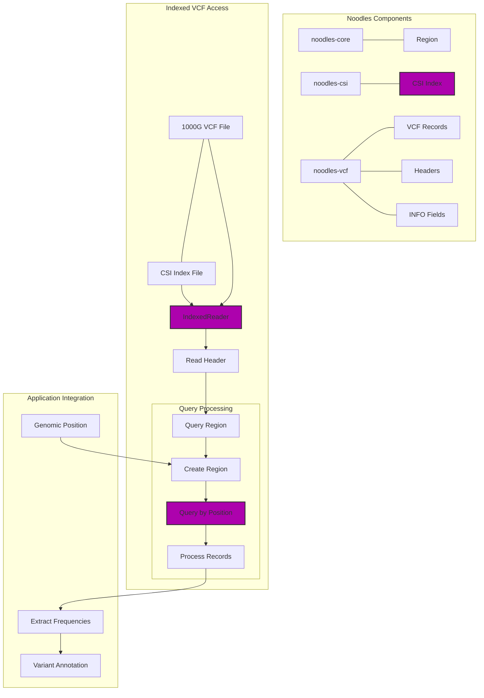

# Noodles Integration in Pathogenic Variant Finder

This document provides a detailed explanation of how the [Noodles](https://github.com/zaeleus/noodles) Rust libraries are integrated into the Pathogenic Variant Finder tool for efficient bioinformatics file handling.

## Overview of Noodles

Noodles is a collection of Rust libraries for handling various bioinformatics file formats, including VCF (Variant Call Format), CSI (Coordinate-Sorted Index), and many others. It provides both high-level operations and low-level parsers and writers for these formats.

In the Pathogenic Variant Finder, we specifically use three core components of Noodles:

1. **noodles-vcf**: For working with Variant Call Format files
2. **noodles-csi**: For handling Coordinate-Sorted Indices
3. **noodles-core**: For common data structures like genomic regions



## Dependency Management

The tool manages Noodles dependencies through the umbrella crate with specific features enabled:

```toml
# Meta-crate with features enabled
noodles = { version = "0.95.0", features = ["vcf", "csi", "core"] }
```

This approach ensures we have access to all needed functionality through a single dependency while only including the components we actually need.

## Module Imports

The relevant Noodles modules are imported at the top of the file:

```rust
// Using the individual crates
use noodles_vcf as vcf;
use noodles_csi as csi;
use noodles_core::region::Region;
```

## Indexed VCF Access

### Loading CSI Index

Noodles is primarily used for indexed access to the 1000 Genomes VCF file. This begins with loading the CSI index:

```rust
let index_file = File::open(&onekg_index_path)?;
let mut csi_reader = csi::io::Reader::new(index_file);
let index = csi_reader.read_index()?;
```

The CSI index provides a mapping from genomic coordinates to file positions, enabling efficient random access to specific regions within a potentially large VCF file.

### Creating an Indexed Reader

Once the index is loaded, an indexed reader is created:

```rust
let file = File::open(&onekg_file_path)?;
let mut reader = vcf::io::indexed_reader::IndexedReader::new(file, index);
```

This reader combines the raw VCF file with its index to allow position-based queries.

### Reading the VCF Header

The header contains important metadata about the VCF file, including descriptions of INFO fields that will be needed later:

```rust
let header = reader.read_header()?;
```

This header is required both for understanding the structure of the records and for subsequent queries.

### Querying by Region

A key feature of indexed access is the ability to query specific genomic regions:

```rust
let region_str = format!("{}:{}-{}", chr, pos, pos);
let region_obj: Region = region_str.parse()?;
if let Ok(mut query) = reader.query(&header, &region_obj) {
    // Process results
}
```

This creates a Region object from a string representation (e.g., "1:12345-12345") and uses it to query the indexed VCF.

### Iterating Through Query Results

The query returns an iterator over records in the specified region:

```rust
while let Some(record) = query.next() {
    let record = record?;
    // Process the record
}
```

## VCF Record Processing

### Accessing Record Fields

Noodles provides structured access to VCF record fields:

```rust
let record_chr = record.reference_sequence_name().to_string();
let record_pos = record.variant_start().expect("Failed to get variant start")?;
let record_ref = record.reference_bases().to_string();
```

This approach is type-safe and handles the complexities of the VCF format.

### Working with Alternate Alleles

Multiple alternate alleles are handled through Noodles' iterator interface:

```rust
let record_alts: Vec<String> = record
    .alternate_bases()
    .iter()
    .filter_map(Result::ok)
    .map(|a| a.to_string())
    .collect();
```

### Accessing INFO Fields

INFO fields contain additional annotations, including allele frequencies. Noodles provides structured access to these fields:

```rust
let info = record.info();
```

### Extracting Typed Values

Noodles handles the type conversion from INFO fields:

```rust
match info.get(&header, key) {
    Some(Ok(Some(Value::Array(array)))) => {
        match array {
            vcf::record::info::field::value::Array::Float(values) => {
                let mut iter = values.iter();
                if let Some(Ok(Some(f))) = iter.nth(alt_idx) {
                    Some(f64::from(*f))
                } else {
                    None
                }
            },
            _ => None, // Handle other Array variants
        }
    },
    _ => None,
}
```

This code checks if a specific INFO field exists, verifies it's an array of floats, and extracts the value at a specific index (corresponding to the alternate allele).

## Benefits of Using Noodles

1. **Random Access**: Enables efficient querying of specific regions without scanning the entire file
2. **Type Safety**: Provides strongly-typed interfaces to VCF data structures
3. **Error Handling**: Uses Rust's Result type for robust error handling
4. **Standard Compliance**: Implements proper VCF specification handling
5. **Performance**: Optimized for efficiency in both memory and CPU usage

## Custom Parsing vs. Noodles

The Pathogenic Variant Finder uses custom parsing for some VCF files (ClinVar VCF and user input) while using Noodles for others (1000 Genomes). This design decision was made for specific reasons:

1. **Custom Parsing**: Used for full file scans where specific fields need to be extracted and where Rayon's parallel processing can be applied line-by-line.

2. **Noodles**: Used when random access is required, particularly for the 1000 Genomes VCF where we only need to access specific positions rather than scanning the entire file.

This hybrid approach combines the flexibility of custom parsing with the efficient indexed access of Noodles.

## Error Handling with Noodles

Noodles uses Rust's Result type for error handling. The Pathogenic Variant Finder properly propagates these errors:

```rust
let region_obj: Region = region_str.parse()?;
if let Ok(mut query) = reader.query(&header, &region_obj) {
    while let Some(record) = query.next() {
        let record = record?;
        // Process record
    }
}
```

The `?` operator is used to propagate errors, ensuring robust error handling.

## Future Noodles Integration Opportunities

1. **Replace Custom Parsing**: Consider using Noodles for all VCF parsing to ensure standard compliance.
2. **Async Support**: Leverage Noodles' async features for non-blocking I/O.
3. **Writer Integration**: Use Noodles' writer functionality for outputting results in VCF format.
4. **Additional Formats**: Integrate other Noodles-supported formats like BAM or CRAM for future extensions.

By understanding the Noodles integration, developers can leverage its capabilities to enhance the Pathogenic Variant Finder with additional features while maintaining efficiency and standard compliance. 