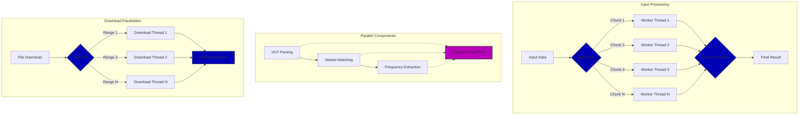

# Parallel Processing in Pathogenic Variant Finder

This document details how the Pathogenic Variant Finder leverages Rust's parallel processing capabilities, primarily through the Rayon library, to achieve high performance when processing genomic data.

## Overview of Parallel Processing Strategy

The Pathogenic Variant Finder employs parallel processing at multiple stages:

1. **Data Downloading**: Uses parallel chunk downloads for reference databases
2. **VCF Parsing**: Processes VCF lines in parallel using Rayon
3. **Variant Matching**: Conducts parallel lookups against reference databases
4. **Frequency Extraction**: Processes genomic regions concurrently

These parallel approaches significantly improve performance, especially on multi-core systems.



## Rayon Integration

[Rayon](https://github.com/rayon-rs/rayon) is a data parallelism library for Rust that makes it easy to convert sequential computations into parallel ones. It's particularly well-suited for this application due to its work-stealing scheduler and simple API.

### Dependencies

Rayon is included as a dependency in Cargo.toml:

```toml
# Rayon for parallel iteration (multi-threaded processing)
rayon = "1.10"
```

### Imports

Rayon's parallel iterators are imported at the top of the file:

```rust
use rayon::prelude::*;
```

This brings `par_iter()`, `par_iter_mut()`, and related extension methods into scope.

## Parallel VCF Parsing

One of the most computationally intensive tasks is parsing the ClinVar VCF file. Rayon is used to parallelize this process:

```rust
let chunk_maps: Vec<ClinVarMap> = lines
    .par_iter()
    .map(|line| {
        pb.inc(1);
        match parse_clinvar_line(line) {
            None => HashMap::new(),
            Some(records) => {
                let mut local_map = HashMap::with_capacity(records.len());
                for r in records {
                    let key = (r.chr.clone(), r.pos, r.ref_allele.clone(), r.alt_allele.clone());
                    local_map.insert(key, r);
                }
                local_map
            }
        }
    })
    .collect();
```

Key aspects of this implementation:

1. **Local Maps**: Each thread builds its own local HashMap
2. **Collection Step**: Results are combined at the end
3. **Progress Tracking**: Atomic counter updates track progress
4. **Thread Safety**: Rayon ensures thread-safe parallel execution

This approach allows the parser to efficiently utilize all available CPU cores.

### Similar Pattern for User VCF

The same pattern is used for parsing the user's input VCF:

```rust
let chunk_variants: Vec<Vec<(String, InputVariant)>> = lines
    .par_iter()
    .map(|line| {
        pb.inc(1);
        match parse_input_line(line) {
            None => vec![],
            Some((l, iv)) => vec![(l, iv)],
        }
    })
    .collect();
```

## Parallel Variant Matching

When matching user variants against ClinVar data, Rayon's `par_iter()` is combined with `flat_map_iter()` for efficient parallel processing:

```rust
let temp_results: Vec<TempRecord> = input_variants
    .par_iter()
    .flat_map_iter(|(_, iv)| {
        let mut local_found = Vec::new();
        for (alt_a, is_present) in &iv.alts {
            if !is_present {
                continue;
            }
            let key = (iv.chr.clone(), iv.pos, iv.ref_allele.clone(), alt_a.clone());
            if let Some(cv) = clinvar_map.get(&key) {
                if !cv.is_alt_pathogenic {
                    continue;
                }
                // Add to local results
                local_found.push(TempRecord { /* ... */ });
            }
        }
        pb.inc(1);
        local_found
    })
    .collect();
```

This pattern:
1. Processes variants in parallel
2. Returns multiple results per input variant (via `flat_map_iter`)
3. Combines results from all threads automatically

## Thread-Safe Progress Reporting

The tool uses progress bars from the `indicatif` crate which are designed to be thread-safe:

```rust
let pb = ProgressBar::new(total);
pb.set_style(
    ProgressStyle::default_bar()
        .template("{spinner:.green} [{elapsed_precise}] {bar:40.cyan/blue} {pos}/{len} ({eta})")
        .unwrap()
        .progress_chars("=>-"),
);
```

Progress is updated from multiple threads:

```rust
.par_iter()
.map(|line| {
    pb.inc(1);
    // Process line
})
```

The `ProgressBar` handles thread safety internally, ensuring accurate progress reporting.

## Parallel Downloads

Beyond Rayon, parallel processing is also used for downloading reference databases:

```rust
fn download_file(
    url: &str,
    out_path: &Path,
    log_file: &mut File,
) -> Result<(), DownloadError> {
    // ...
    let num_chunks = num_cpus::get();
    let chunk_size = total_size / num_chunks as u64;
    // ...
    
    for (i, (start, end)) in ranges.into_iter().enumerate() {
        let client = client.clone();
        let url = url.to_string();
        let progress = Arc::clone(&progress);
        let handle = thread::spawn(move || -> Result<(usize, Vec<u8>), DownloadError> {
            // Download chunk
        });
        handles.push(handle);
    }
    // ...
}
```

This approach:
1. Uses standard Rust threads rather than Rayon
2. Divides the download into chunks based on CPU count
3. Downloads chunks in parallel
4. Uses atomic counters for combined progress tracking
5. Reassembles the chunks in the correct order

## Coordination and Data Sharing

### Atomic Progress Tracking

For parallel downloads, atomic counters track progress across threads:

```rust
let progress = Arc::new(AtomicU64::new(0));
// ...
progress.fetch_add(n as u64, Ordering::Relaxed);
// ...
while progress.load(Ordering::Relaxed) < total_size {
    pb.set_position(progress.load(Ordering::Relaxed));
    std::thread::sleep(std::time::Duration::from_millis(100));
}
```

This ensures thread-safe coordination without locks.

### Shared Immutable State

The tool follows Rust's ownership principles, sharing immutable state across threads:

```rust
let temp_results: Vec<TempRecord> = input_variants
    .par_iter() // Shared immutable access to input_variants
    .flat_map_iter(|(_, iv)| {
        // ... 
        if let Some(cv) = clinvar_map.get(&key) { // Shared immutable access to clinvar_map
            // ...
        }
    })
    .collect();
```

This approach avoids locks while ensuring thread safety.

## Performance Considerations

### Dynamic Thread Pool

Rayon automatically creates a thread pool optimized for the current system:

```rust
println!(
    "  -> Loaded user VCF ({} lines). Using {} CPU cores.",
    lines.len(),
    num_cpus::get()
);
```

The thread pool size adapts to the available cores, maximizing CPU utilization.

### Work Stealing

Rayon's work-stealing scheduler dynamically balances workload across threads. This is particularly beneficial when processing VCF files with varying line complexities.

### Combining Results

Results from parallel operations are efficiently combined:

```rust
// Combine ClinVar maps from parallel processing
let mut final_map = HashMap::new();
for cm in chunk_maps {
    final_map.extend(cm);
}
```

This approach minimizes lock contention during the parallel processing phase.

## CPU Utilization

The parallel approach ensures high CPU utilization:

1. **Auto-detection**: Uses `num_cpus` to detect available cores
2. **Adaptive Chunking**: Divides work based on available parallelism
3. **Work Balancing**: Rayon's work-stealing adjusts to varying workloads
4. **Minimal Contention**: Local result aggregation minimizes lock contention

## Performance Gains

The parallel approach provides significant performance benefits:

1. **Near-linear Scaling**: Performance improves with additional cores
2. **Reduced I/O Bottlenecks**: Parallel downloads maximize bandwidth utilization
3. **Balanced CPU Usage**: Work-stealing ensures all cores remain busy
4. **Memory Efficiency**: Local data aggregation minimizes shared state

## Future Enhancements

Potential improvements to parallel processing:

1. **Configurable Parallelism**: Allow users to specify thread count
2. **I/O-Bound Optimizations**: Further optimize for I/O-bound operations
3. **Better Work Distribution**: Implement smarter task division strategies
4. **Pipeline Parallelism**: Implement producer-consumer patterns for streaming processing

By leveraging Rayon and other parallel processing techniques, the Pathogenic Variant Finder achieves high performance while maintaining code simplicity and safety through Rust's ownership system. 