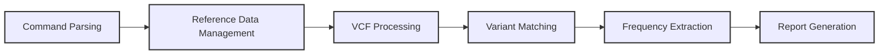

# Technical Overview: Pathogenic Variant Finder

This document provides a high-level technical overview of the Pathogenic Variant Finder's architecture and components. For usage instructions and general information, refer to the [main README](../README.md) in the root directory.

## Documentation Index

1. [Implementation Details](implementation_details.md) - Core architecture, data flow, data structures
2. [Noodles Integration](noodles_integration.md) - Integration with bioinformatics libraries
3. [Parallel Processing](parallel_processing.md) - Performance optimization techniques
4. [Reporting Features](reporting_features.md) - Output formats and reporting capabilities
5. [1000 Genome Frequency Extraction](1000genome_frequency_extraction.md) - Population allele frequency integration

## Technical Architecture

### Core Components

The Pathogenic Variant Finder follows a modular pipeline architecture with these key technical components:

1. **Command Parsing**
   - Uses Clap for ergonomic command-line argument parsing
   - Supports genome build selection, input files, variant filtering, and report options

2. **Reference Data Management**
   - Downloads necessary reference databases via HTTP(S)
   - Implements multi-threaded download with chunking for performance
   - Handles HTTP range requests with graceful fallback
   - Manages database versions based on genome builds

3. **VCF Processing**
   - Custom parsers for user VCF and ClinVar VCF input
   - Memory-efficient line-by-line processing of large files
   - Normalizes genomic coordinates and variant representations
   - Handles both gzipped and uncompressed files

4. **Variant Matching Engine**
   - Efficient genomic variant matching with HashMap-based lookups
   - Parallel processing with Rayon for multi-core utilization
   - Classification of variants into pathogenic/benign/VUS categories

5. **Frequency Extraction System**
   - Random access to 1000 Genomes VCF using Noodles CSI indexing
   - Population-specific allele frequency extraction
   - Targeted queries to minimize memory usage

6. **Report Generation**
   - CSV, text statistics, and markdown report generation
   - Chromosome-based sorting algorithms for organized output
   - Category-based variant organization

### Technology Stack

| Component | Technologies Used |
|-----------|------------------|
| Core Language | Rust |
| Concurrency | Rayon, std::thread, atomic counters |
| File Formats | Noodles (VCF, CSI), flate2 (gzip) |
| Network | reqwest for HTTP requests |
| CLI | clap for argument parsing |
| Progress Tracking | indicatif for progress visualization |
| Output | csv crate, std::fs for file I/O |

## Pipeline Flow

## Performance Considerations

- **Memory Efficiency**: Optimized to handle large genomic datasets with minimal memory usage through targeted data structures and streaming processing.
- **CPU Utilization**: Implements parallel processing at multiple stages to efficiently use available cores.
- **I/O Optimization**: Minimizes disk access through targeted indexed lookups and buffered reading.

For detailed performance optimization techniques, see [Parallel Processing](parallel_processing.md).

## Error Handling Strategy

The application implements robust error handling with:
- Custom error types for different failure modes
- Proper propagation of errors with the `?` operator
- Detailed logging of errors and processing steps
- Graceful fallbacks for non-critical failures

## Future Technical Directions

Priority areas for technical enhancement:

1. **Indexed Input Processing**: Support for indexed access to input VCF files
2. **Cache Management System**: Reference data versioning and automated updates
3. **Configuration Framework**: External configuration files for customization
4. **Testing Infrastructure**: Comprehensive unit and integration tests
5. **Performance Profiling**: Identification of additional optimization opportunities

For implementation details of specific components, refer to the specialized documentation files listed in the Documentation Index. 